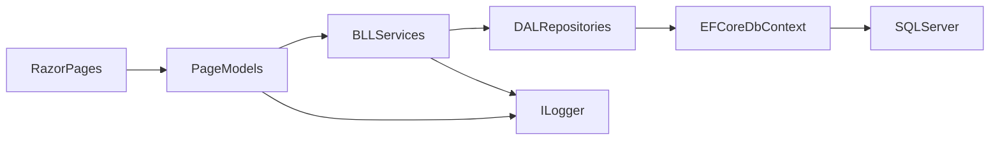

# План разработки веб-приложения (Razor Pages + EF Core)

## Выбранный стек и обоснование
- UI: **Razor Pages** (быстрее и проще для CRUD при ограниченном времени).
- Backend: **ASP.NET Core Web App (Razor Pages)** + сервисный слой на C#.
- Data: **EF Core Code-First**, миграции, **SQL Server**.
- Обязательные элементы на «відмінно»: **Dependency Injection** и **логирование/моніторинг**.

## Контекст продукта (уточненный и финальный)
- Продукт: упрощенная система персонализированного планування харчування **без IoT-телеметрии и без recommendation engine**.
- Ценность: на основе данных пользователя (профиль, активность, цель) автоматически формировать дневной план КБЖУ и структуру приемов пищи.
- Ограничение проекта: учебная реализация с акцентом на корректную архитектуру, CRUD, валидацию, миграции и демонстрируемую бизнес-логику.
- Подход к реализации: **MVP-first** — реализуем только то, что уже поддерживает твоя схема БД.

## Границы MVP (что делаем сейчас)
- **Must Have (в релиз 1)**:
  - Профиль пользователя (`User`) с уровнем активности.
  - Генерация дневного плана (`DailyDietPlan`) по цели пользователя.
  - Декомпозиция плана на приемы пищи (`Meal`) с целевыми КБЖУ.
  - Справочник рецептов/продуктов (`Recipe`, `Product`) и связи many-to-many (`MealRecipe`, `RecipeProduct`).
  - CRUD для ключевых сущностей, валидация, DI, логирование.
- **Should Have (если успеваем)**:
  - Полуавтоматический подбор рецептов в прием пищи по целевым КБЖУ.
  - Проверка допустимого отклонения КБЖУ между планом и суммой приемов.
- **Later (исключаем из текущей реализации)**:
  - Любая телеметрия, IoT-браслет, WebSocket/SignalR.
  - Recommendation module, AI/ML, чат-помощник, долгосрочные прогнозы.
  - React/.NET MAUI клиент, подписки/монетизация.
  - Микросервисная архитектура.

## Покрытие major features в учебной версии
- Реализуем ядро: персональный план питания (`MF-2`) и базовое управление целями (`MF-7`) через модель пользователя.
- Частично: элементы анализа через сравнение плановых КБЖУ и состава приемов пищи (`MF-11` в упрощении, без телеметрии).
- Не реализуем в релизе 1: `MF-1`, `MF-3`, `MF-4`, `MF-5`, `MF-6`, `MF-8`, `MF-9`, `MF-10` (зависят от динамических данных/истории/рекомендаций).

## Упрощенные бизнес-правила для первой версии
- Расчет суточной калорийности на основе пользователя:
  - BMR (Mifflin-St Jeor) по `gender/height/weight`,
  - умножение на `activity_level` => TDEE,
  - корректировка по цели (`loss/maintain/gain`).
- Распределение макросов:
  - белки/жиры/углеводы по фиксированным коэффициентам (зафиксируем в конфиге сервиса),
  - значения сохраняются в `DailyDietPlan`.
- Распределение по приемам пищи:
  - `daily_plan_number_of_meals` определяет число `Meal`,
  - КБЖУ делятся равномерно или по шаблону процентов (например 30/40/30).
- Рецепты и продукты:
  - `RecipeProduct.grams` хранит состав рецепта,
  - расчет КБЖУ рецепта можно делать при создании/обновлении (или хранить вручную по БД и валидировать непротиворечивость).

## Архитектура (трехслойная: DAL | BLL | UI)
- **DAL (Data Access Layer)**:
  - Содержит EF Core и все, что связано с доступом к данным.
  - Рекомендуемая структура: `Data` (`AppDbContext`, `Configurations`, `Seed`), `Repositories`, `Interfaces`, `Migrations`.
  - Отвечает за CRUD в БД и работу с сущностями.
- **BLL (Business Logic Layer)**:
  - Содержит прикладную логику и use-cases.
  - Рекомендуемая структура: `Services`, `Interfaces`, `DTO` (по необходимости), `Mapping` (опционально).
  - Здесь размещается генерация `DailyDietPlan`, расчеты КБЖУ, валидации бизнес-правил.
- **UI (Presentation Layer)**:
  - `Razor Pages` (`Pages`, `PageModels`, ViewModels при необходимости).
  - Вызывает только BLL-сервисы, без прямой работы с `DbContext`.
- **Зависимости слоев**:
  - `UI -> BLL -> DAL`.
  - Обратные зависимости запрещены.
- **DI**:
  - Регистрация `DbContext` и репозиториев (DAL), сервисов (BLL), логирования и конфигураций в `Program.cs`.
- **Логирование**:
  - `ILogger<T>` в сервисах и PageModel.
  - Структурированные логи CRUD-операций, генерации планов и ошибок.
  - Централизованная обработка ошибок на уровне UI.

## Доменный срез по твоей схеме БД
- `User` (`user_id`, `first_name`, `last_name`, `email`, `gender`, `height`, `weight`, `activity_level`).
- `DailyDietPlan` (`daily_diet_plan_id`, `user_id`, `daily_plan_calories`, `daily_plan_proteins`, `daily_plan_fats`, `daily_plan_carbs`, `daily_plan_day`, `daily_plan_number_of_meals`).
- `Meal` (`meal_id`, `daily_diet_plan_id`, `meal_order`, `meal_time`, `meal_calories`, `meal_proteins`, `meal_fats`, `meal_carbs`).
- `Recipe` (`recipe_id`, `recipe_instructions`, `recipe_calories`, `recipe_proteins`, `recipe_fats`, `recipe_carbs`).
- `Product` (`product_id`, `product_name`, `product_calories_per_100g`, `product_proteins_per_100g`, `product_fats_per_100g`, `product_carbs_per_100g`).
- `MealRecipe` (join: `meal_id`, `recipe_id`).
- `RecipeProduct` (join: `recipe_id`, `product_id`, `grams`).

## Поток данных

## Этапы реализации
1. Подготовка проекта
- Создать решение и проект `ASP.NET Core Razor Pages`.
- Подключить пакеты EF Core для SQL Server и миграций.
- Настроить строку подключения и базовый `DbContext`.

2. Модель данных (по твоей схеме БД)
- Описать сущности и связи (1:1, 1:N, N:M где нужно).
- Добавить `Fluent API`/аннотации для ограничений, индексов, обязательных полей.
- Настроить composite key для `MealRecipe` и `RecipeProduct`.

3. Code-First + миграции
- Сгенерировать первую миграцию.
- Применить миграцию к SQL Server.
- Проверить соответствие схеме и ограничениям.

4. CRUD + GUI
- Для основных сущностей сделать страницы: `Index`, `Create`, `Edit`, `Details`, `Delete`.
- Добавить серверную и клиентскую валидацию (`DataAnnotations`, validation tag helpers).
- Приоритет страниц MVP:
  - `User`,
  - `DailyDietPlan`,
  - `Meal`,
  - `Recipe`,
  - `Product`.

5. DI и сервисный слой
- Вынести бизнес-операции в BLL-сервисы.
- Подключить репозитории DAL и сервисы BLL через встроенный DI-контейнер.
- Минимизировать логику в `PageModel` (тонкий UI-слой, вызовы только BLL).

6. Логирование/мониторинг
- Логировать create/update/delete и ошибки в сервисах.
- Добавить request logging и централизованную обработку ошибок.
- (Опционально, если останется время) подключить Serilog + file sink для наглядности в демонстрации.

7. Тест и защита
- Проверка CRUD-сценариев и валидации (ручной smoke-test).
- Подготовить README: стек, запуск, миграции, что реализовано по требованиям.
- Подготовить GitHub-репозиторий в формате `PNET_Прізвище_ім’я`.

## Критерии готовности (Definition of Done)
- Проект запускается локально и подключается к SQL Server.
- Есть рабочий CRUD для `User`, `DailyDietPlan`, `Meal`, `Recipe`, `Product`.
- Миграции создаются и применяются без ручного редактирования БД.
- Валидация блокирует невалидные значения (даты, отрицательные/вне диапазона метрики и т.д.).
- Соблюдена трехслойная архитектура: `UI -> BLL -> DAL` без прямого доступа UI к `DbContext`.
- DI используется не формально: репозитории и сервисы внедряются через интерфейсы.
- Логи показывают ключевые сценарии (create/update/delete, генерация плана, ошибки).
- README содержит шаги запуска, миграций и описание реализованных MF.

## Что нужно от тебя для старта реализации
- Подтвердить поле цели пользователя (`goal`) и где его хранить (рекомендовано в `User` как enum).
- Название репозитория и префикс/нейминг проекта.
